# Jarkom-Modul-2-B16-2023
**Praktikum Jaringan Komputer Modul 2 Tahun 2023**

## Kelompok B16
| Nama | NRP |Github |
|---------------------------|------------|--------|
|Ahmad Fauzan A | 5025211091 | https://github.com/--- |
|Syomeron Ansell W | 5025211540 | https://github.com/Ansell10 |

# Laporan Resmi
## Topologi


## Nomor 1-8
```
#!/bin/bash
echo nameserver 192.168.122.1 > /etc/resolv.conf
apt-get update
apt-get install bind9 -y


echo 'zone "arjuna.B16.com" {
type slave;
masters {192.186.2.2;};
file "/var/lib/bind/arjuna.B16.com" ;
};


zone "abimanyu.B16.com" {
type slave;
masters {192.186.2.2;};
file "/var/lib/bind/abimanyu.B16.com" ;
};

zone "baratayuda.abimanyu.B16.com" {
type master;
file "/etc/bind/baratayuda/baratayuda.abimanyu.B16.com";
};

zone "1.186.192.in-addr.arpa" {
type slave;
masters {192.186.2.2;};
file "/var/lib/bind/1.186.192.in-addr.arpa" ;
};' > /etc/bind/named.conf.local

echo 'options {
        directory "/var/cache/bind";

        // If there is a firewall between you and nameservers you want
        // to talk to, you may need to fix the firewall to allow multiple
        // ports to talk.  See http://www.kb.cert.org/vuls/id/800113

        // If your ISP provided one or more IP addresses for stable
        // nameservers, you probably want to use them as forwarders.
        // Uncomment the following block, and insert the addresses replacing
        // the all-0'"'"'s placeholder.

        // forwarders {
        //      0.0.0.0;
        // };

        //========================================================================
        // If BIND logs error messages about the root key being expired,
        // you will need to update your keys.  See https://www.isc.org/bind-keys
        //========================================================================
        //dnssec-validation auto;
        allow-query{any;};

        auth-nxdomain no;    # conform to RFC1035
        listen-on-v6 { any; };
};' > /etc/bind/named.conf.options


mkdir /etc/bind/baratayuda

cp /etc/bind/db.local /etc/bind/baratayuda/baratayuda.abimanyu.B16.com

echo '$TTL    604800
@       IN      SOA     baratayuda.abimanyu.B16.com. root.baratayuda.abimanyu.B16.com. (
                         2023101101     ; Serial
                         604800         ; Refresh
                          86400         ; Retry
                        2419200         ; Expire
                         604800 )       ; Negative Cache TTL
;
@               IN      NS      baratayuda.abimanyu.B16.com.
@               IN      A       192.186.1.4
rjp             IN      A       192.186.1.4
www             IN      CNAME   baratayuda.abimanyu.B16.com.
www.rjp         IN      CNAME   baratayuda.abimanyu.B16.com.' > /etc/bind/baratayuda/baratayuda.abimanyu.B16.com

service bind9 restart
```

## Nomer 1
Yudhistira akan digunakan sebagai DNS Master, Werkudara sebagai DNS Slave, Arjuna merupakan Load Balancer yang terdiri dari beberapa Web Server yaitu Prabakusuma, Abimanyu, dan Wisanggeni. Buatlah topologi dengan pembagian sebagai berikut. Folder topologi dapat diakses pada drive berikut 


## Nomer 2
Buatlah website utama pada node arjuna dengan akses ke arjuna.yyy.com dengan alias www.arjuna.yyy.com dengan yyy merupakan kode kelompok.


## Nomer 3
Dengan cara yang sama seperti soal nomor 2, buatlah website utama dengan akses ke abimanyu.yyy.com dan alias www.abimanyu.yyy.com.


## Nomer 4
Kemudian, karena terdapat beberapa web yang harus di-deploy, buatlah subdomain parikesit.abimanyu.yyy.com yang diatur DNS-nya di Yudhistira dan mengarah ke Abimanyu.


## Nomer 5
Buat juga reverse domain untuk domain utama. (Abimanyu saja yang direverse)


## Nomer 6
Agar dapat tetap dihubungi ketika DNS Server Yudhistira bermasalah, buat juga Werkudara sebagai DNS Slave untuk domain utama.


## Nomer 7
Seperti yang kita tahu karena banyak sekali informasi yang harus diterima, buatlah subdomain khusus untuk perang yaitu baratayuda.abimanyu.yyy.com dengan alias www.baratayuda.abimanyu.yyy.com yang didelegasikan dari Yudhistira ke Werkudara dengan IP menuju ke Abimanyu dalam folder Baratayuda.


## Nomer 8
Untuk informasi yang lebih spesifik mengenai Ranjapan Baratayuda, buatlah subdomain melalui Werkudara dengan akses rjp.baratayuda.abimanyu.yyy.com dengan alias www.rjp.baratayuda.abimanyu.yyy.com yang mengarah ke Abimanyu.


## Nomor 9 dan 10

9. Arjuna merupakan suatu Load Balancer Nginx dengan tiga worker (yang juga menggunakan nginx sebagai webserver) yaitu Prabakusuma, Abimanyu, dan Wisanggeni. Lakukan deployment pada masing-masing worker.

10. Kemudian gunakan algoritma Round Robin untuk Load Balancer pada Arjuna. Gunakan server_name pada soal nomor 1. Untuk melakukan pengecekan akses alamat web tersebut kemudian pastikan worker yang digunakan untuk menangani permintaan akan berganti ganti secara acak. Untuk webserver di masing-masing worker wajib berjalan di port 8001-8003.

Untuk menyelesaikan soal ini, akan dilakukan configurasi di arjuna terlebih dahulu sebagai berikut

-   instalasi nginx

```sh
apt-get update
apt-get install nginx
```

-   tambahkan konfigurasi pada `/etc/bind/nginx/sites-available/lb-arjuna`

```
upstream myweb  {
        server 192.186.1.4:8001; # port abimanyu web server
        server 192.186.1.5:8002; # port prabukusuma web server
        server 192.186.1.6:8003; # port wisanggeni web server
 }

 server {
        listen 80;
        server_name arjuna.b16.com;

        location / {
        proxy_pass http://myweb;
        }
 }
```

-   lakukan perintah `ln -s /etc/nginx/sites-available/lb-arjuna /etc/nginx/sites-enabled` untuk enable load balancernya.


Kemudian untuk konfigurasi pada webserver, install nginx dan php pada masing-masing webserver
-   lakukan perintah `apt-get update && apt install nginx php php-fpm -y`
-   buat direktori untuk semua domain `mkdir /var/www/[domain]` 
```sh
mkdir /var/www/abimanyu.b16
mkdir /var/www/arjuna.b16
mkdir /var/www/parikesit.abimanyu.b16
mkdir /var/www/rjp.baratayuda.abimanyu.b16
```
-   lakukan download file requirement dengan menjalankan kode berikut
```sh
cd /var/www/abimanyu.b16 && curl -L -o abimanyu.zip --insecure "https://drive.google.com/uc?export=download&id=1a4V23hwK9S7hQEDEcv9FL14UkkrHc-Zc" &&
  unzip abimanyu.zip && cd abimanyu.yyy* && mv * .. && cd .. && rm abimanyu.yyy* -d && rm *.zip && cd ~

cd /var/www/arjuna.b16 && curl -L -o arjuna.zip --insecure "https://drive.google.com/uc?export=download&id=17tAM_XDKYWDvF-JJix1x7txvTBEax7vX" &&
  unzip arjuna.zip && cd arjuna.yyy* && mv * .. && cd .. && rm arjuna.yyy* -d && rm *.zip && cd ~

cd /var/www/parikesit.abimanyu.b16 && curl -L -o file.zip --insecure "https://drive.google.com/uc?export=download&id=1LdbYntiYVF_NVNgJis1GLCLPEGyIOreS" &&
  unzip file.zip && cd parikesit.abimanyu.yyy* && mv * .. && cd .. && rm parikesit.abimanyu.yyy* -d && rm *.zip && cd ~

cd /var/www/parikesit.abimanyu.b16 && rm -d -rf parikesit.abimanyu.yyy* && mkdir secret && touch rahasia.html && echo '<!DOCTYPE html>
<html>
<head>
    <title>Secret Page</title>
</head>
<body>
    <h1>This is a secret</h1>
</body>
</html>
' > rahasia.html && cd ~

cd /var/www/rjp.baratayuda.abimanyu.b16 && curl -L -o file.zip --insecure "https://drive.google.com/uc?export=download&id=1pPSP7yIR05JhSFG67RVzgkb-VcW9vQO6" &&
  unzip file.zip && cd rjp.baratayuda.abimanyu.yyy* && mv * .. && cd .. && rm rjp.baratayuda.abimanyu.yyy* -d && rm *.zip && cd ~
```

-   Start service php-fpm `service php7.0-fpm start`

Kemudian, pergi ke /etc/nginx/sites-available dan buat file baru bernama arjuna.b16, isikan dengan
```
server {

        listen 8001;

        root /var/www/arjuna.b16;

        index index.php index.html index.htm;
        server_name arjuna.b16.com;

        location / {
                        try_files $uri $uri/ /index.php?$query_string;
        }

        # pass PHP scripts to FastCGI server
        location ~ \.php$ {
        include snippets/fastcgi-php.conf;
        fastcgi_pass unix:/run/php/php7.0-fpm.sock;
        }

 location ~ /\.ht {
                        deny all;
        }

        error_log /var/log/nginx/arjunab16_error.log;
        access_log /var/log/nginx/arjunab16_access.log;
 }
```

Dengan catatan port mengikuti ketentuan Abimanyu:8001, Prabukusuma:8002, dan Wisanggeni:8003.

testing ke arjuna.b16.com

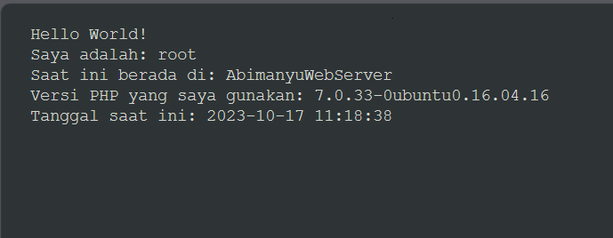
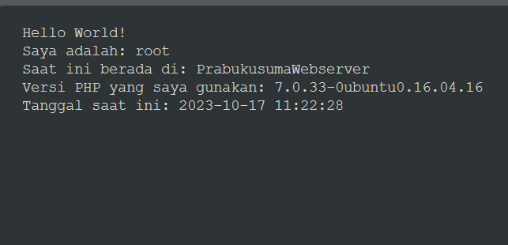
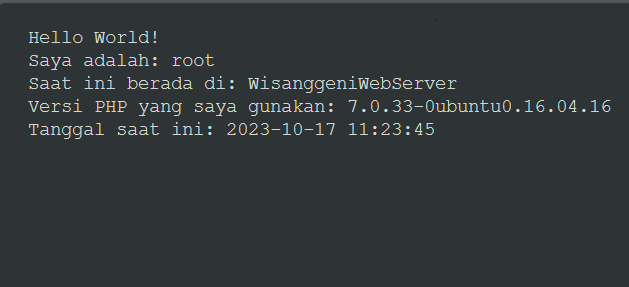


## Nomor 11 dan 12

11. Selain menggunakan Nginx, lakukan konfigurasi Apache Web Server pada worker Abimanyu dengan web server www.abimanyu.yyy.com. Pertama dibutuhkan web server dengan DocumentRoot pada /var/www/abimanyu.yyy

12. Setelah itu ubahlah agar url www.abimanyu.yyy.com/index.php/home menjadi www.abimanyu.yyy.com/home.

Untuk menjawab ini, perlu install apache2 pada abimanyu

```sh
apt-get install apache2 -y
apt-get install libapache2-mod-php7.0 -y
```

Kemudian buat file baru pada /etc/apache2/sites-available/ bernama abimanyu.b16.com.conf, isikan dengan ini

```
<VirtualHost *:80>

        ServerAdmin webmaster@localhost
        DocumentRoot /var/www/abimanyu.b16
        ServerName abimanyu.b16.com
        ServerAlias www.abimanyu.b16.com

        Alias "/home" "/var/www/abimanyu.b16/index.php/home"

        ErrorLog ${APACHE_LOG_DIR}/error.log
        CustomLog ${APACHE_LOG_DIR}/access.log combined
</VirtualHost>
```

Pada command diatas, domain abimanyu.b16.com akan memiliki root pada /var/www/abimanyu.b16 sehingga menjawab soal nomor 11.

untuk nomor 12, sudah terjawab pada baris `Alias "/home" "/var/www/abimanyu.b16/index.php/home"`, dimana jika /home akan mengdirect ke index.php/home.

# Hasil
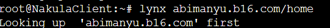
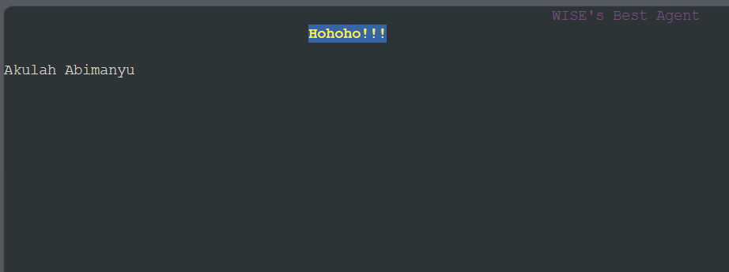


## Nomor 13, 14, 15, 16, dan 20

13. Selain itu, pada subdomain www.parikesit.abimanyu.yyy.com, DocumentRoot disimpan pada /var/www/parikesit.abimanyu.yyy

14. Pada subdomain tersebut folder /public hanya dapat melakukan directory listing sedangkan pada folder /secret tidak dapat diakses (403 Forbidden).

15. Buatlah kustomisasi halaman error pada folder /error untuk mengganti error kode pada Apache. Error kode yang perlu diganti adalah 404 Not Found dan 403 Forbidden.

16. Buatlah suatu konfigurasi virtual host agar file asset www.parikesit.abimanyu.yyy.com/public/js menjadi 
www.parikesit.abimanyu.yyy.com/js 

20. Karena website www.parikesit.abimanyu.yyy.com semakin banyak pengunjung dan banyak gambar gambar random, maka ubahlah request gambar yang memiliki substring “abimanyu” akan diarahkan menuju abimanyu.png.

Pertama, kita konfigurasikan untuk domain parikesit menggunakan apache di abimanyu saja. Caranya adalah dengan membuat file baru bernama `parikesit.abimanyu.b16.com.conf` pada direktori `/etc/apache2/sites-available`

```sh
 touch /etc/apache2/sites-available/abimanyu.b16.com.conf
 ```

 kemudian isikan dengan konfigurasi berikut :
 ```
 <VirtualHost *:80>

        ServerAdmin webmaster@localhost
        DocumentRoot /var/www/parikesit.abimanyu.b16
        ServerName parikesit.abimanyu.b16.com
        ServerAlias www.parikesit.abimanyu.b16.com

        <Directory /var/www/parikesit.abimanyu.b16/public>
                Options +Indexes
        </Directory>

        <Directory /var/www/parikesit.abimanyu.b16/secret>
                Options -Indexes
        </Directory>

        Alias /js /var/www/parikesit.abimanyu.b16/public/js

        RewriteEngine On
        RewriteCond %{REQUEST_URI} abimanyu
        RewriteRule ^(.+\.(?:jpg|jpeg|png|gif))$ /public/images/abimanyu.png [L,R=304]

        ErrorDocument 404 /error/404.html
        ErrorDocument 403 /error/403.html

        ErrorLog ${APACHE_LOG_DIR}/error.log
        CustomLog ${APACHE_LOG_DIR}/access.log combined
</VirtualHost>
 ```

 Setelah itu lakukan linking ke `/etc/apache2/sites-enable` dengan command
 ```sh
 a2ensite parikesit.abimanyu.b16.com
 ```

 Penjelasan :
 -  Untuk nomor 13, terjawab pada bagian ini untuk meng-set root dari domain
 ```
 DocumentRoot /var/www/parikesit.abimanyu.b16
 ```

 -  Untuk nomor 14, /public dapat dilakukan directory listing dengan

```
<Directory /var/www/parikesit.abimanyu.b16/public>
                Options +Indexes
</Directory>

```

 -  Untuk nomor 14, /secret tidak dapat dilakukan directory listing dengan

```
<Directory /var/www/parikesit.abimanyu.b16/secret>
                Options -Indexes
</Directory>
```

-   Untuk nomor 15, kustomisasi halaman error page dengan kode 404 dan 403, terdapat pada baris berikut. DImana /error terdapat pada /var/www/parikesit.abimanyu.b16

```
ErrorDocument 404 /error/404.html
ErrorDocument 403 /error/403.html
```

-   Untuk nomor 16, mengdirect /js ke www.parikesit.abimanyu.yyy.com/public/js dapat menggunakan alias berikut

```
Alias /js /var/www/parikesit.abimanyu.b16/public/js
```

-   Untuk nomor 19, agar ip dari domain tersebut di direct ke domain parikesit, bisa menggunakan pada konfigurasi parikesit.abimanyu.b16.com.conf

```
        RewriteEngine On
        RewriteCond %{REQUEST_URI} abimanyu
        RewriteRule ^(.+\.(?:jpg|jpeg|png|gif))$ /public/images/abimanyu.png [L,R=304]
```

# Testing

cmd : `lynx parikesit.abimanyu.b16.com`

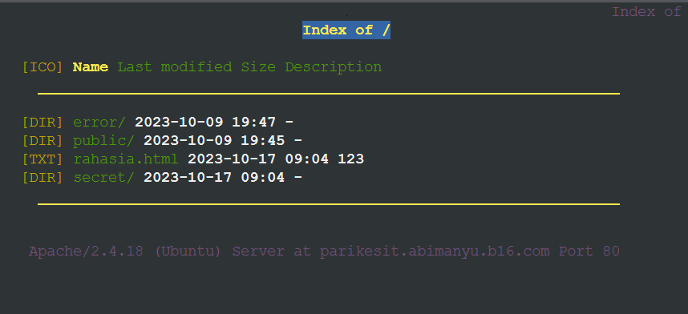

cmd : `lynx parikesit.abimanyu.b16.com/public`

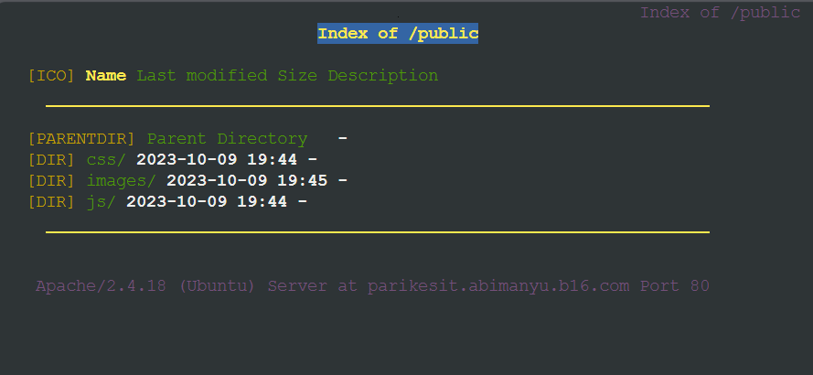

cmd : `lynx parikesit.abimanyu.b16.com/secret`
testing 403

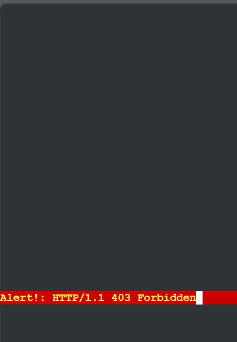


cmd : `lynx parikesit.abimanyu.b16.com/random`
testing 404

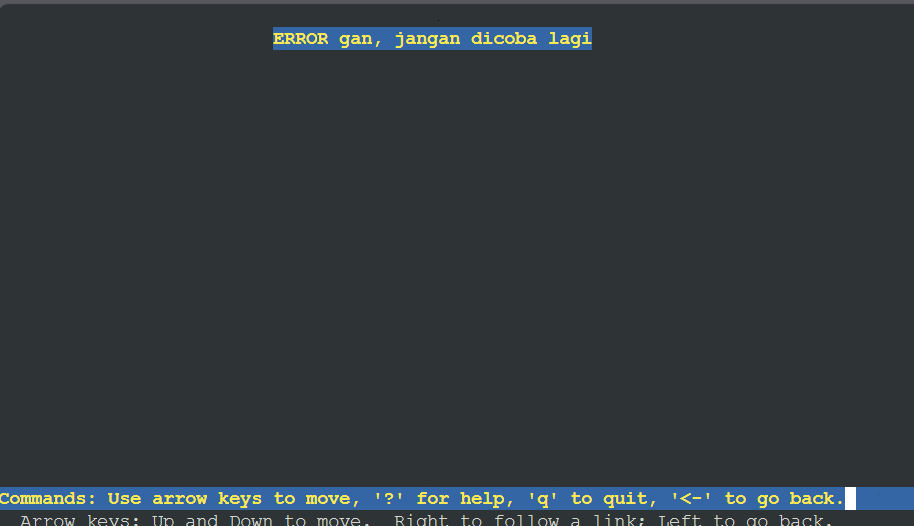

cmd : `lynx parikesit.abimanyu.b16.com/public/images/testabimanyu.png`

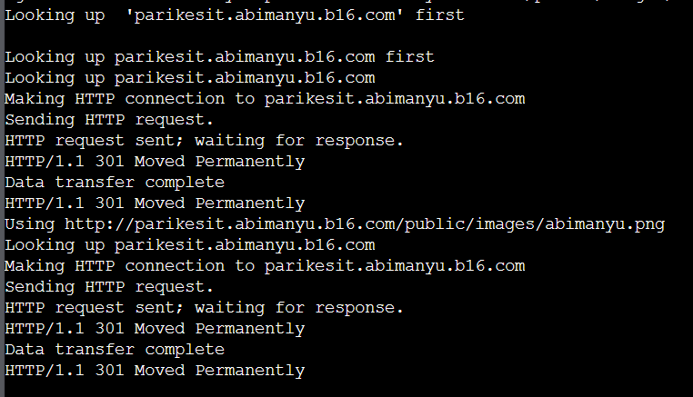

cmd : `lynx 192.186.1.4`

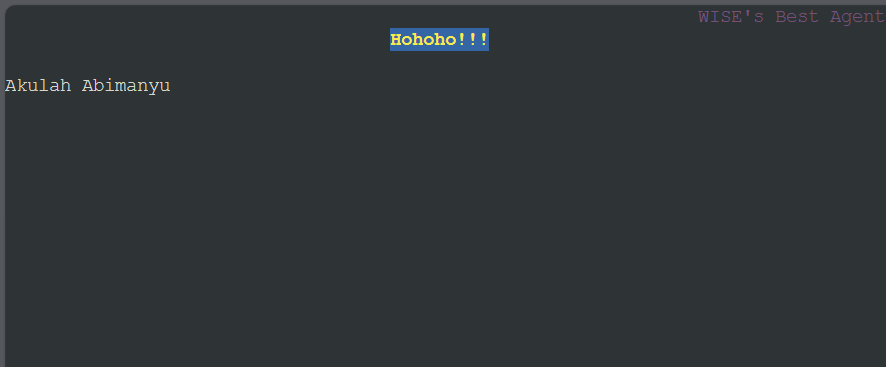

## Nomor 17, 18, 19

17. Agar aman, buatlah konfigurasi agar www.rjp.baratayuda.abimanyu.yyy.com hanya dapat diakses melalui port 14000 dan 14400.

18. Untuk mengaksesnya buatlah autentikasi username berupa “Wayang” dan password “baratayudayyy” dengan yyy merupakan kode kelompok. Letakkan DocumentRoot pada /var/www/rjp.baratayuda.abimanyu.yyy.

19. Buatlah agar setiap kali mengakses IP dari Abimanyu akan secara otomatis dialihkan ke www.abimanyu.yyy.com (alias)

Sama seperti domain yang lainnya, kita tambahkan file baru pada
`/etc/apache2/sites-available`

dan isikan dengan :
```
<VirtualHost *:14000 *:14400>

        ServerAdmin webmaster@localhost
        DocumentRoot /var/www/rjp.baratayuda.abimanyu.b16
        ServerName rjp.baratayuda.abimanyu.b16.com
        ServerAlias www.rjp.baratayuda.abimanyu.b16.com

        <Directory /var/www/rjp.baratayuda.abimanyu.b16>
                Options +Indexes
                AuthType Basic
                AuthName "Restricted Content"
                AuthUserFile /etc/apache2/.htpasswd
                Require valid-user
        </Directory>

        RewriteEngine On
        RewriteCond %{HTTP_POST} ^192\.186\.1\.4$
        RewriteRule ^(.*) http://rjp.baratayuda.abimanyu.b16.com/$1 [L,R=301]

        

        ErrorLog ${APACHE_LOG_DIR}/error.log
        CustomLog ${APACHE_LOG_DIR}/access.log combined
</VirtualHost>
```

Kemudian lakukan 
```
a2ensite rjp.baratayuda.abimanyu.b16.com
```

Penjelasan
-   Nomor 17, sudah jelas pada bagian atas file
```
<VirtualHost *:14000 *:14400>
```
Menandakan domain ini hanya dapat diakses melalui port 14000 dan 14400.

jangan lupa untuk menambahkan kedua port tersebut pada *ports.conf* di `/etc/apache2/ports.conf`. sehingga akan seperti ini isinya
```
Listen 80
Listen 14000
Listen 14400

<IfModule ssl_module>
        Listen 443
</IfModule>

<IfModule mod_gnutls.c>
        Listen 443
</IfModule>
```

-   Untuk nomor 18, menambahkan password dapat dengan command berikut
```
htpasswd -c /etc/apache2/.htpasswd Wayang
```

nanti akan ada prompt untuk memasukkan password, masukkan "baratayudab16"


Jangan lupa menambahkan command `a2enmode rewrite` Setelah menambahkan isi ke file tersebut (rjp.baratayuda.abimanyu.b16.com.conf).

-   Untuk nomor 19, mengarahkan akses ip ke domain:
```
        RewriteEngine On
        RewriteCond %{HTTP_POST} ^192\.186\.1\.4$
        RewriteRule ^(.*) http://rjp.baratayuda.abimanyu.b16.com/$1 [L,R=301]

```

# Testing

- Akses melalui port 14000, dimintai username dan password. 

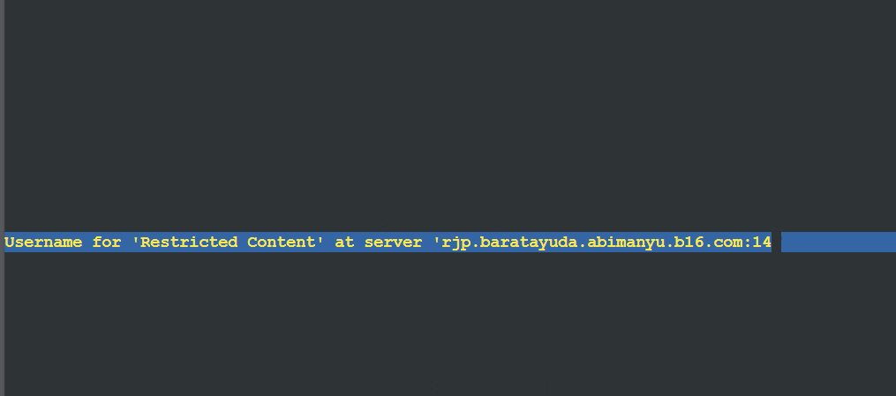

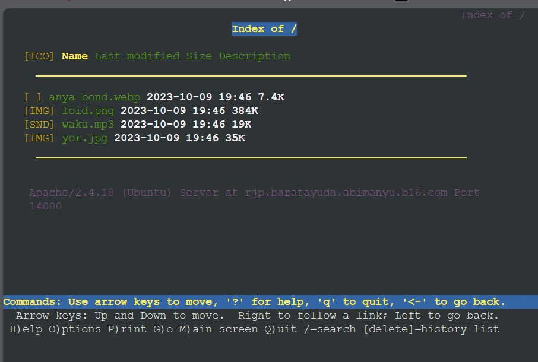

- Akses melalui port 14400, dimintai username dan password. 


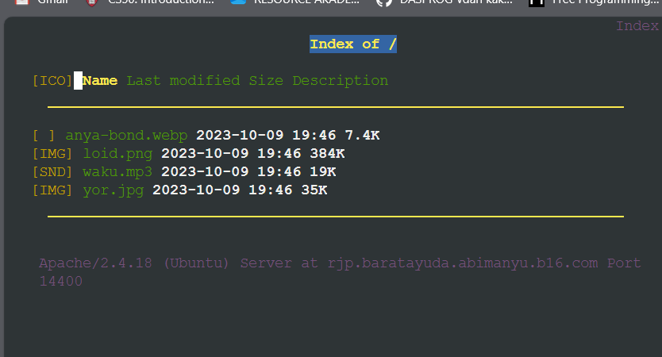
